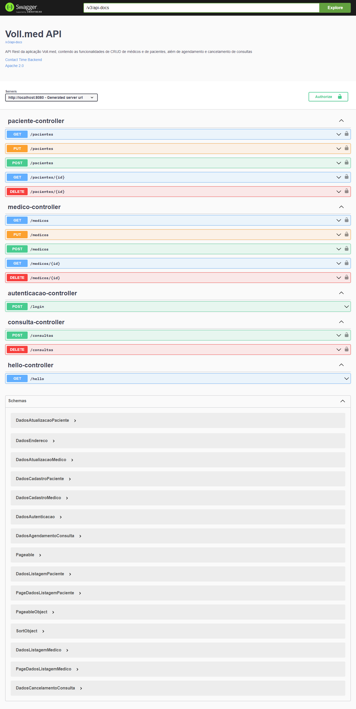

# API REST documentada de uma clínica médica

## Sobre

Por meio desta API é possível cadastrar usuários e médicos, realizar agendamento de consultas e criar perfis.

## Pré-requesitos para testar a API localmente.

* [x] Ter uma IDE instalada;
* [x] Ter o Git instalado;
* [x] Ter o MySql instalado;
* [x] Crie um banco com o nome `vollmed_api`
* [x] Verifique se há a necessidade de modificar o user e password do BD no arquivo `application.properties`;
* [x] Clonar o repositório;

## Para realizar consultas por meio da documentação utilize o endereço a seguir: 

- Necessário realizar o login e informar um token válido.

http://localhost:8080/swagger-ui/index.html

